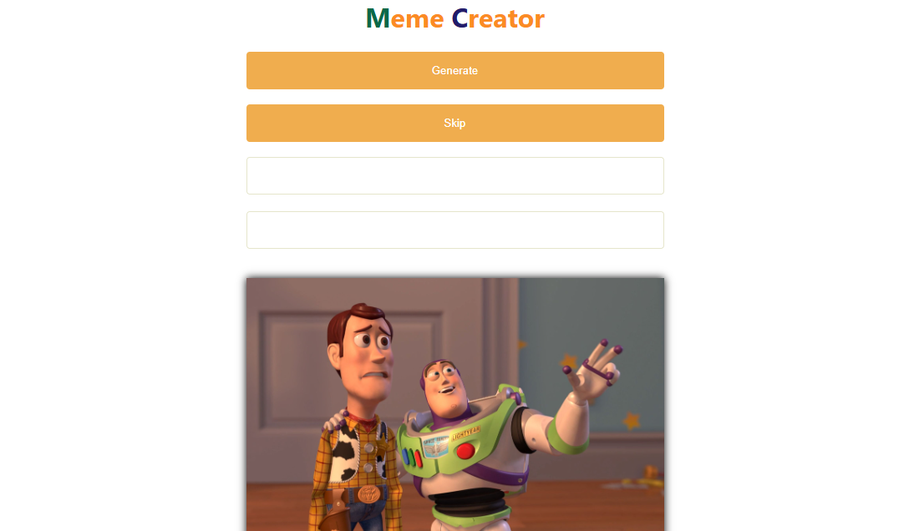
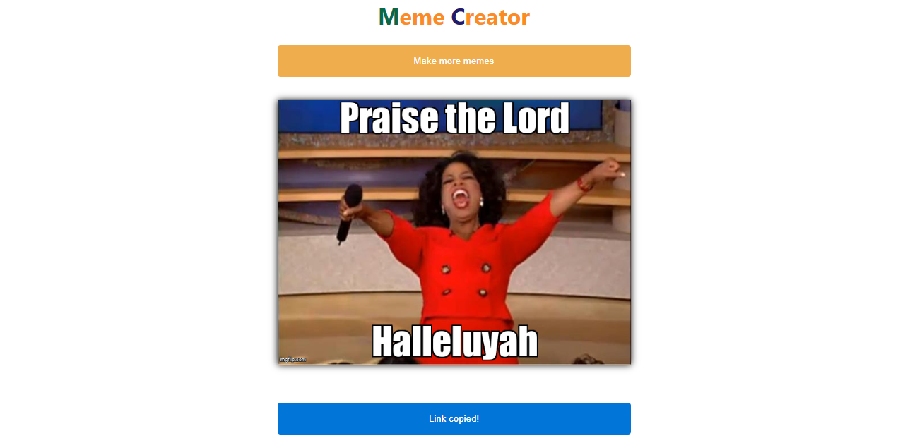

# Meme Generation App

## Table of contents

- [Overview](#overview)
  - [Functionality](#functionality)
  - [Screenshot](#screenshot)
  - [Links](#links)
- [My process](#my-process)
  - [Built with](#built-with)
- [Author](#author)

## Overview

### Functionality

Users should be able to:

- View the optimal layout for each page depending on the device's screen size.
- Get memes from imgflip API.
- Skip meme.
- Enter a caption according to the number of fields from the meme API and click generate to generate the meme with the captioned text.
- Copy the link generated with caption and open it on a new tab.

### Screenshot

### Links

- [Github]()
- [Live URL]()

## My process

### Built with

## Author
- Twitter - [@jonahunuafe](https://www.twitter.com/jonahunuafe)
- Linkedin - [jonahunuafe](https://www.linkedin.com/in/jonahunuafe)

